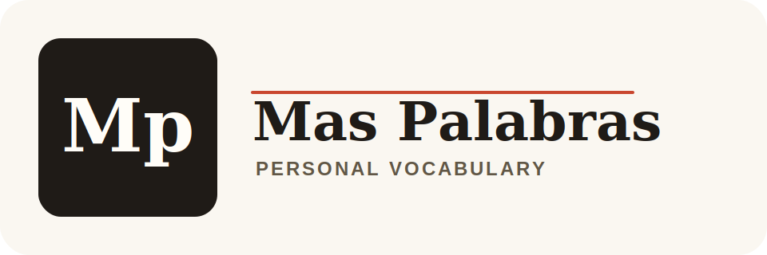
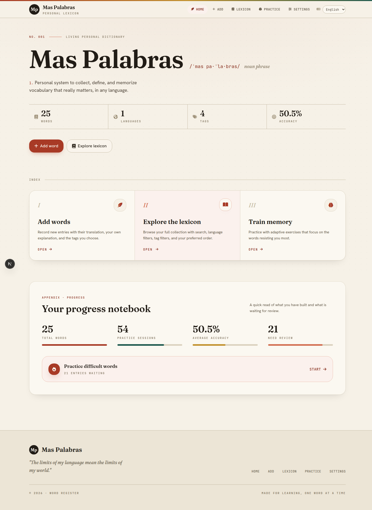
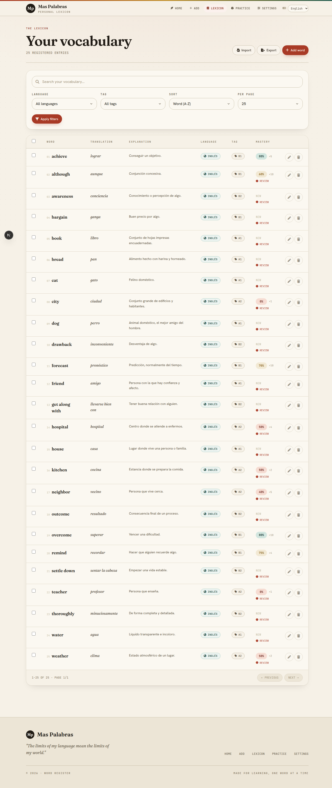
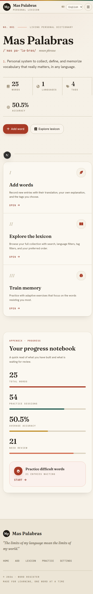

<p align="center">
  
</p>

# Mas Palabras

Mas Palabras is a personal vocabulary app for people who collect words while studying, reading, working, or living in another language.

It gives you a small system to save vocabulary, organize it by language and tag, import or export it as JSON, and practice it with adaptive quizzes that focus on new and weak words.

## Why This Exists

Language learners often keep vocabulary scattered across notebooks, notes apps, spreadsheets, screenshots, and chat messages. Mas Palabras turns that into one structured personal lexicon:

- capture a word or expression with its translation and your own explanation
- classify entries by language and tag
- search and filter your vocabulary later
- practice words that need more review
- import existing lists from JSON
- export your data whenever you want

The current product is best suited for local study and experimentation with language-learning workflows.

## Table of Contents

- [Screenshots](#screenshots)
- [Core Workflows](#core-workflows)
- [Features](#features)
- [Tech Stack](#tech-stack)
- [Quick Start](#quick-start)
- [Environment Variables](#environment-variables)
- [Common Scripts](#common-scripts)
- [Import and Export](#import-and-export)
- [Data Model](#data-model)
- [Testing](#testing)
- [Production Build](#production-build)
- [Project Structure](#project-structure)
- [Documentation](#documentation)
- [Current Limits](#current-limits)
- [Contributing](#contributing)
- [License](#license)

## Screenshots

### Dashboard



### Lexicon



### Mobile



## Core Workflows

### Build a personal lexicon

Create entries with a source word, translation, optional explanation, language, and tag. The app normalizes source words to prevent duplicate entries within the same language.

### Browse and maintain vocabulary

Use the lexicon page to search, filter by language or tag, sort by creation date or accuracy, edit entries, and delete one or several words.

### Practice with adaptive quizzes

Quiz sessions can target all words, new words, or words that need practice. A word needs practice when it has never been practiced, has fewer than 3 attempts, or has accuracy below 70%.

### Keep data portable

Export all vocabulary as JSON. Import JSON lists with duplicate handling and optional creation of missing languages or tags.

### Switch interface language

The interface currently supports English, Spanish, and Catalan through a cookie-backed selector.

## Features

- Personal vocabulary dashboard
- Word creation, editing, deletion, filtering, sorting, and bulk deletion
- Language and tag management
- Adaptive quiz sessions
- Progress counters per word
- JSON import and export
- Interface language selector
- English, Spanish, and Catalan UI dictionaries
- SQLite persistence through Prisma
- Zod validation for server-side inputs
- Vitest unit tests
- GitHub Actions CI for test and build

## Tech Stack

- Next.js 16 App Router
- React 19
- TypeScript
- Tailwind CSS
- Prisma
- SQLite
- Zod
- Vitest

## Quick Start

### Requirements

- Node.js 22 or newer
- pnpm 9.15.4 or compatible

### Install

```bash
pnpm install
cp .env.example .env
pnpm prisma:migrate:dev --name init
```

### Run locally

```bash
pnpm dev
```

Open:

```text
http://127.0.0.1:3000
```

### Add data

You can add entries manually from the app, or import a JSON file from `/import_words`.

A small sample list exists at:

```text
prisma/sample-words.json
```

## Environment Variables

Minimum:

```env
DATABASE_URL="file:./dev.db"
```

Optional:

```env
NEXT_PUBLIC_SITE_URL="https://your-domain.example"
```

`NEXT_PUBLIC_SITE_URL` is used for metadata URL generation. If it is not defined, the app falls back to `http://localhost:3000`.

Do not commit real `.env` files, local SQLite databases, generated builds, logs, tokens, or keys.

## Common Scripts

```bash
pnpm dev
pnpm build
pnpm start
pnpm start:local
pnpm test
pnpm test:watch
pnpm prisma:generate
pnpm prisma:migrate:dev --name change_name
pnpm prisma:migrate:deploy
```

Script notes:

- `pnpm dev` starts the Next.js dev server against `prisma/dev.db`.
- `pnpm build` creates a production build and runs TypeScript checks.
- `pnpm start:local` runs the standalone server against `prisma/dev.db`.
- `pnpm start` respects the `DATABASE_URL` from the environment.

## Import and Export

Export route:

```text
GET /export_words
```

Import route:

```text
/import_words
```

Expected JSON shape:

```json
[
  {
    "english_word": "house",
    "translation": "home",
    "explanation": "where people live",
    "language": "English",
    "tag": "A1"
  }
]
```

Optional import fields:

- `times_practiced`
- `times_correct`
- `last_practiced`

Import supports duplicate skipping or updating, and can create missing languages or tags when requested.

See [Guides/import-export.md](Guides/import-export.md) for full details.

## Data Model

The current schema has four main tables:

- `word`
- `language`
- `tag`
- `quiz_session`

Important domain rules:

- duplicates are detected by `(language_id, normalized_english_word)`
- source-word normalization lives in `lib/text.ts`
- languages and tags are soft-deleted when they have associated words
- quiz answers update `times_practiced`, `times_correct`, and `last_practiced`
- weak/new words are prioritized by the quiz flow

## Testing

```bash
pnpm test
pnpm build
```

`pnpm test` runs the Vitest unit suite. `pnpm build` runs the production build and Next.js TypeScript checks.

Current tests cover:

- text normalization
- word metrics
- flash-message helpers
- word search and sorting
- import/export behavior
- quiz utility behavior

## Production Build

```bash
pnpm build
pnpm start:local
```

For a standalone run with an explicit SQLite database, set an absolute database URL and run:

```bash
DATABASE_URL="file:/absolute/path/prod.db" pnpm start
```

Recommended standalone flow:

```bash
pnpm install
pnpm prisma:migrate:deploy
pnpm build
DATABASE_URL="file:/absolute/path/prod.db" pnpm start
```

## Project Structure

```text
app/                # Next.js App Router routes
components/         # Shell, navigation, table, forms, shared UI
lib/                # Domain logic, Prisma, validation, i18n, server actions
prisma/             # Prisma schema and migrations
tests/              # Vitest tests
Guides/             # Internal engineering documentation
docs/assets/        # README images and public assets
```

## Documentation

Start with:

- [Guides/architecture.md](Guides/architecture.md)
- [Guides/backend.md](Guides/backend.md)
- [Guides/frontend.md](Guides/frontend.md)
- [Guides/security.md](Guides/security.md)
- [Guides/TODO/local-app-roadmap.md](Guides/TODO/local-app-roadmap.md)
- [Guides/TODO/product-vision.md](Guides/TODO/product-vision.md)

## Current Limits

- one state-changing quiz endpoint still uses GET
- no custom CSP
- no automated E2E tests
- no offline/PWA mode yet

See [SECURITY.md](SECURITY.md) and [Guides/security.md](Guides/security.md).

## Contributing

See [CONTRIBUTING.md](CONTRIBUTING.md).

The expected workflow is:

1. create a branch from `main`
2. make a focused change
3. run validation
4. commit with a Conventional Commit message
5. open a pull request into `main`

## License

Mas Palabras is released under the [MIT License](LICENSE).
